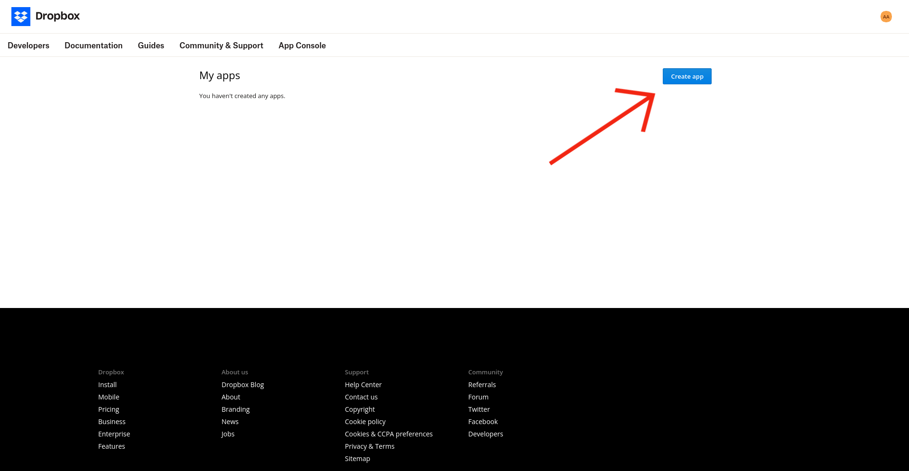
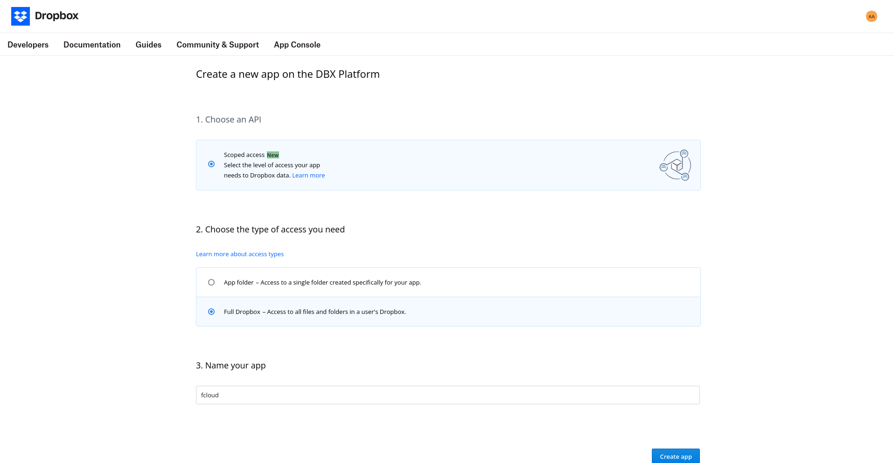
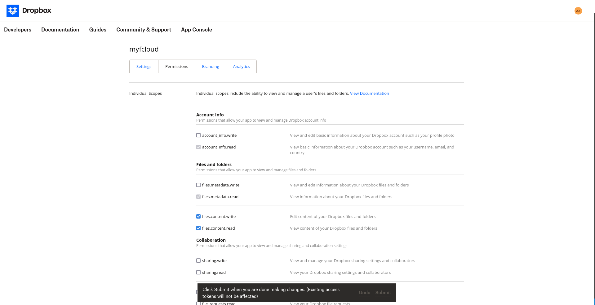

# Dropbox connect

Follow these steps to connect Dropbox:

1. Create a Dropbox account - [https://www.dropbox.com](https://www.dropbox.com)

2. Next, you need to create app. Go to [https://www.dropbox.com/developers/apps](https://www.dropbox.com/developers/apps) and use "Create app"

3. Customize your application
    
    For example:
    Select *scoped access* and the type of *access* the application has to your storage. It is recommended to select *full access* to the application
    

4. Create app

5. Set the necessary access rights
    Go to the *permissions* tab and select the necessary permissions for the application.
    Necessary access rights for the application to work:

    * files.metadata.read
    * files.content.write
    * files.content.read

    Don't forget to save the change after making the changes.
    

6. Specify dropbox as your cloud
    fcloud config cloud dropbox
7. Set the App key and App secret in fcloud using the following commands:

        fcloud config set-parametr DROPBOX app_key <your app key here>

        fcloud config set-parametr DROPBOX app_secret <your app secret here>

8. Generate access key

        fcloud dropbox get-token

    Use to get the link needed to confirm that the application has been issued an access token. You need to open the link, which will be displayed in the terminal, and confirm that the token has been issued.

    \**Then copy token and paste it into the terminal.*

9. Add a folder to save files to the cloud

        fcloud config folder /my_folder

    Use to add a folder where by default all files that you will upload using fcloud will be saved.

    !!! important
        Before how to add a folder, create one in your cloud
        
#### Done! Now you can make full use of fcloud
Learn more about how to use it [here](/docs/usage/base)