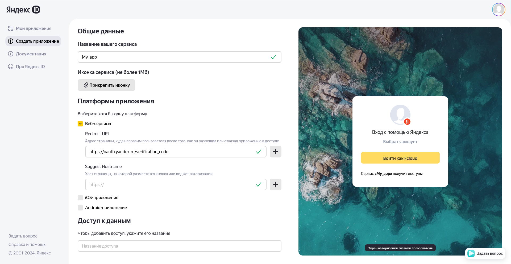

# YandexDisk connect

Follow these steps to connect YandexDisk:

1. Create, an app at this link [https://oauth.yandex.ru/client/new/](https://oauth.yandex.ru/client/new/)

2. Give your service a name and select the ‘Web-services’ platform

3. In the ‘Redirect URI’ field specify: https://oauth.yandex.ru/verification_code

4. Then, one by one, insert these permissions into the field for the requested access rights:
    1. `cloud_api:disk.read`
    2. `cloud_api:disk.write`
    3. `cloud_api:disk.info`

5. Click the create button and you will be taken to your application page

6. Specify yandex as your cloud
    
        fcloud config cloud yandex

7. Set the ClientID and Client secret in fcloud using the following commands:

        fcloud config set-parametr YANDEX client_id <your ClientID here>

        fcloud config set-parametr YANDEX client_secret <your Client secret here>

8. Generate access key

        fcloud yandex get-token

    You will receive a unique link that you will need to click on. After your account has been compromised, you will receive an authorisation code which you will need to provide to fcloud.

9. Add a folder to save files to the cloud

        fcloud config folder /my_folder

    Use to add a folder where by default all files that you will upload using fcloud will be saved.

    !!! important
        Before how to add a folder, create one in your cloud

#### Done! Now you can make full use of fcloud
Learn more about how to use it [here](/docs/usage/base)