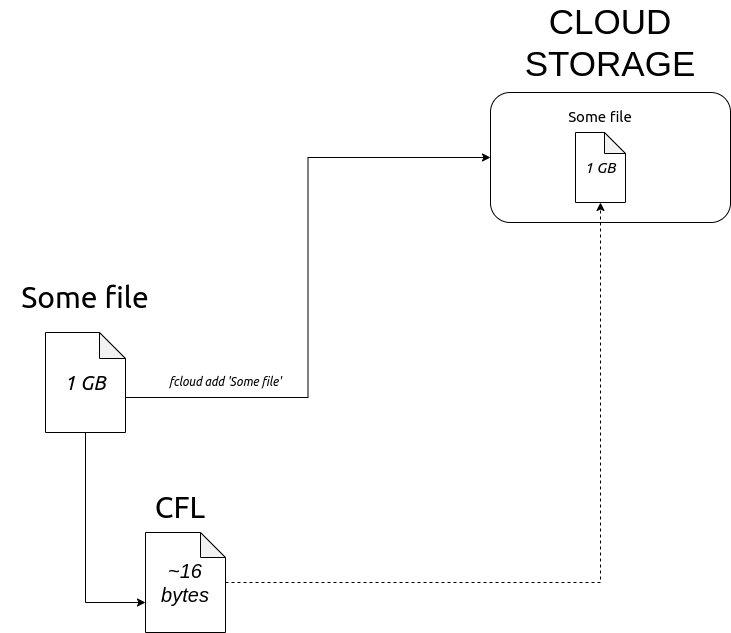

# About project

Fcloud is a simple utility that makes it easy to work with cloud storage. When synchronizing, your files remain on your system with their original file structure intact. Meanwhile, a copy of your data is stored in the cloud.

***

***
## Simple example
  `fcloud add film.mp4` - Uploads the file to the cloud. After this, you'll get a .cfl file. It will be very small in size.

  `fcloud info film.mp4.cfl` - Provides information about the file

  `fcloud get film.mp4.cfl` -  Converts the .cfl file back into film.mp4.

---

## Cloud Storage Supported:

* Dropbox

* YandexDisk

---